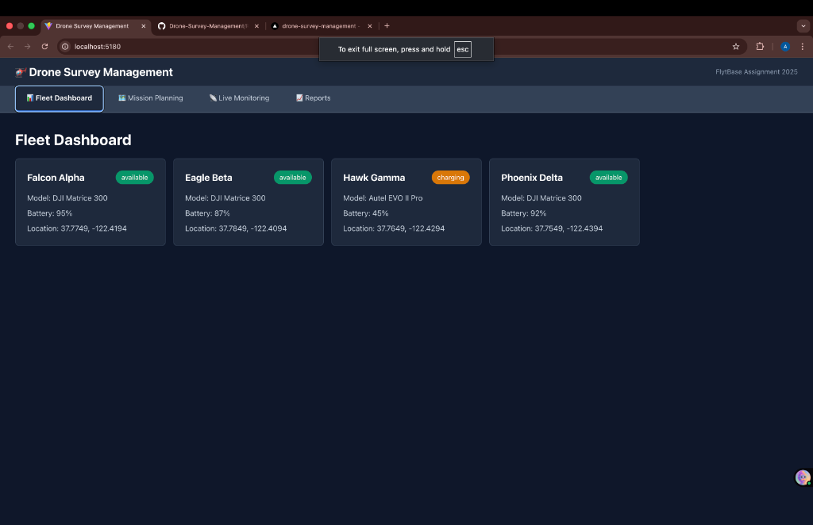
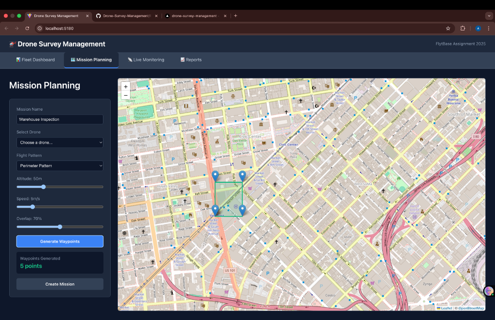
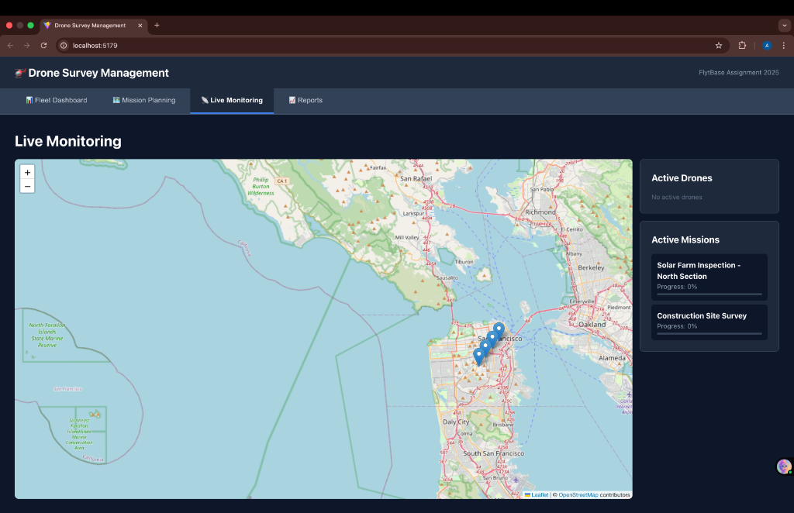
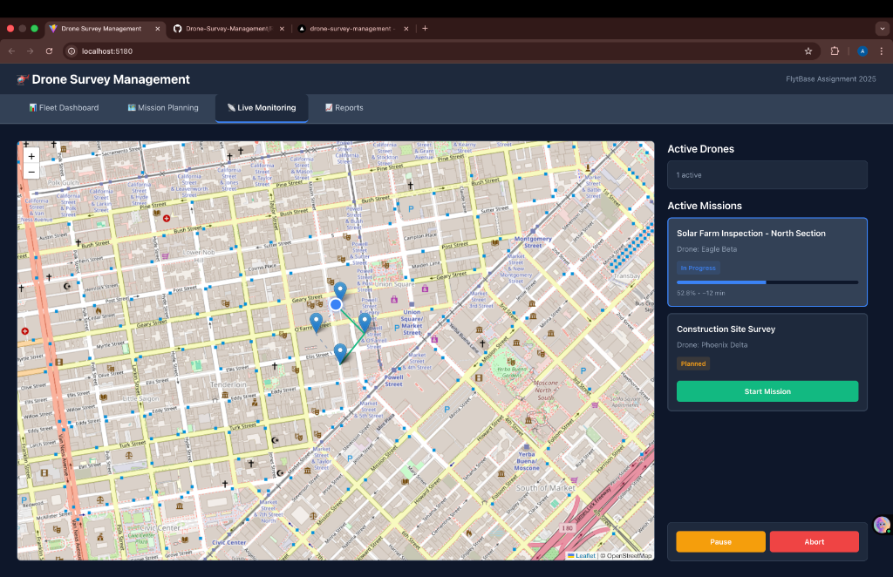

# Drone Survey Management System

> A comprehensive web-based platform for planning, managing, and monitoring autonomous drone survey missions across multiple global sites.

## 🚀 Live Demo

**[View Live Application](https://drone-survey-management-seven.vercel.app/)**

## 🎥 Demo Video

**[Watch Demo Video](https://www.loom.com/share/60da5ad26d784c40a2d9b3229c97dc9e)**

---

## 📋 Table of Contents

- [Overview](#overview)
- [Features](#features)
- [Technology Stack](#technology-stack)
- [Getting Started](#getting-started)
- [Project Structure](#project-structure)
- [Usage Guide](#usage-guide)
- [Screenshots](#screenshots)
- [Contributing](#contributing)

---

## Overview

This Drone Survey Management System is designed to simplify and streamline drone operations for large organizations conducting facility inspections, security patrols, and site mapping. The platform provides a centralized interface for mission planning, real-time monitoring, fleet coordination, and comprehensive reporting.

**Key Capabilities:**
- Plan and configure autonomous survey missions with advanced flight patterns
- Monitor drone fleet status and battery levels in real-time
- Track live mission progress with interactive map visualization
- Generate detailed analytics and reports for completed surveys
- Control missions with pause, resume, and abort functionality

---

## Features

### 1. Mission Planning & Configuration
- **Flight Pattern Generation**: Support for crosshatch and perimeter patterns
- **Customizable Parameters**: Configure altitude (20-120m), speed (3-15 m/s), and overlap percentage (50-90%)
- **Waypoint Management**: Automatic waypoint generation based on selected patterns
- **Drone Assignment**: Select available drones for mission execution
- **Interactive Map Preview**: Visualize planned flight paths before execution

### 2. Fleet Dashboard
- **Organization-wide Inventory**: View all drones in your fleet
- **Real-time Status Tracking**: Monitor drone status (available, in-mission, charging, maintenance)
- **Battery Monitoring**: Track battery levels for each drone
- **Location Tracking**: View current GPS coordinates of all drones
- **Model Information**: Display drone specifications and last maintenance dates

### 3. Live Mission Monitoring
- **Real-time Map Visualization**: Track drone position on interactive map using Leaflet
- **Animated Flight Paths**: Smooth drone movement animation between waypoints
- **Progress Tracking**: View percentage completion and estimated time remaining
- **Mission Status Updates**: Real-time status (starting, in-progress, completed, aborted)
- **Mission Controls**: Pause, resume, or abort missions mid-flight
- **Path Visualization**: See completed path vs. planned route

### 4. Survey Reports & Analytics
- **Organization-wide Statistics**: 
  - Total missions executed
  - Completed vs. aborted missions
  - Active mission count
  - Total flight time and distance
  - Average mission duration
  - Success rate calculation
- **Mission History**: Detailed table of all completed missions
- **Individual Flight Analytics**: Comprehensive statistics for each mission including duration, distance, waypoints, altitude, speed, pattern, and overlap
- **Sortable Data**: Missions sorted by completion date

---

## 🛠 Technology Stack

### Frontend
- **React 18** - UI framework
- **TypeScript** - Type-safe development
- **Vite** - Fast build tool and dev server
- **Zustand** - Lightweight state management
- **React Leaflet** - Interactive map components
- **Leaflet** - Map visualization library

### Styling
- **CSS3** - Custom styling with modern design
- **Responsive Design** - Mobile-friendly interface

### Development Tools
- **ESLint** - Code linting
- **TypeScript Compiler** - Type checking
- **Git** - Version control

### Deployment
- **Vercel** - Hosting and continuous deployment

---

## Getting Started

### Prerequisites
- Node.js (v18 or higher)
- npm or yarn package manager
- Git

### Installation

1. **Clone the repository**
   ```bash
   git clone https://github.com/aish26211/Drone-Survey-Management.git
   cd Drone-Survey-Management
   ```

2. **Install dependencies**
   ```bash
   npm install
   ```

3. **Start the development server**
   ```bash
   npm run dev
   ```

4. **Open your browser**
   Navigate to `http://localhost:5173`

### Build for Production

```bash
npm run build
```

The production-ready files will be in the `dist/` directory.

### Preview Production Build

```bash
npm run preview
```

---

## Project Structure

```
drone-survey-system/
├── src/
│   ├── components/
│   │   ├── FleetDashboard.tsx      # Drone fleet overview
│   │   ├── LiveMonitoring.tsx      # Real-time mission tracking
│   │   ├── MissionPlanning.tsx     # Mission configuration
│   │   └── SurveyReports.tsx       # Analytics and reporting
│   ├── App.tsx                     # Main application component
│   ├── App.css                     # Application styles
│   ├── main.tsx                    # Application entry point
│   ├── index.css                   # Global styles
│   ├── store.ts                    # Zustand state management
│   ├── types.ts                    # TypeScript type definitions
│   └── mockData.ts                 # Sample data for demonstration
├── public/                         # Static assets
├── index.html                      # HTML template
├── package.json                    # Dependencies and scripts
├── tsconfig.json                   # TypeScript configuration
├── vite.config.ts                  # Vite configuration
└── README.md                       # Project documentation
```

---

## Usage Guide

### Creating a Mission

1. Navigate to the **Mission Planning** tab
2. Enter a mission name (e.g., "Warehouse Inspection")
3. Select an available drone from the dropdown
4. Choose a flight pattern (Crosshatch or Perimeter)
5. Adjust parameters:
   - Altitude slider (20-120m)
   - Speed slider (3-15 m/s)
   - Overlap percentage (50-90%)
6. Click **Generate Waypoints** to preview the flight path
7. Review the waypoints on the map
8. Click **Create Mission** to save

### Monitoring a Mission

1. Go to the **Live Monitoring** tab
2. Select a planned mission from the list
3. Click **Start Mission** to begin execution
4. Watch the drone move in real-time on the map
5. Monitor progress percentage and estimated time
6. Use **Pause** or **Abort** buttons if needed

### Viewing Reports

1. Navigate to the **Reports** tab
2. View organization-wide statistics at the top
3. Scroll down to see mission history table
4. Review detailed analytics for recent missions
5. Check individual flight statistics including duration, distance, and parameters

### Managing Fleet

1. Go to the **Fleet Dashboard** tab
2. View all drones with their current status
3. Check battery levels and locations
4. Identify available drones for new missions

---

## Screenshots

### Fleet Dashboard
Monitor your entire drone fleet with real-time status, battery levels, and location tracking.



### Mission Planning
Plan missions with customizable flight patterns (crosshatch/perimeter) and adjustable parameters.



### Live Monitoring
Track drone position and mission progress in real-time with interactive map visualization.



### Mission Control
Control active missions with pause and abort functionality, view progress and estimated time remaining.



---

## Security & Safety

- **Mission Abort**: Immediately stop missions if issues arise
- **Battery Monitoring**: Track battery levels to prevent mid-flight failures
- **Status Tracking**: Real-time drone status updates
- **Error Handling**: Graceful handling of edge cases

---

## Key Highlights

- ✅ **100% TypeScript** - Type-safe codebase
- ✅ **Responsive Design** - Works on desktop and mobile
- ✅ **Real-time Updates** - Live mission tracking
- ✅ **Professional UI** - Clean, modern interface
- ✅ **Scalable Architecture** - Modular component design
- ✅ **Advanced Patterns** - Crosshatch and perimeter support
- ✅ **Comprehensive Analytics** - Detailed reporting

---

## License

This project is developed as part of the FlytBase assignment.

---

## 👤 Author

**Aish Sinha**
---


